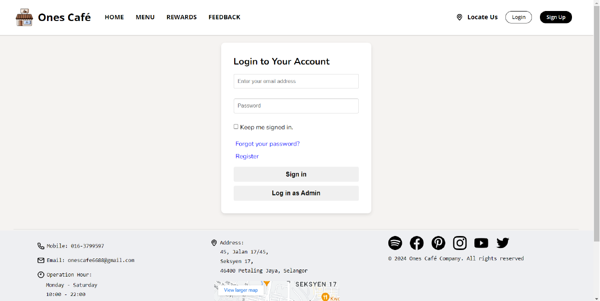
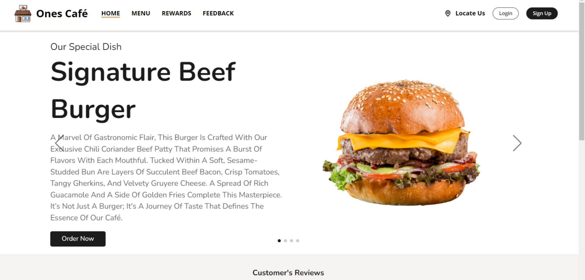
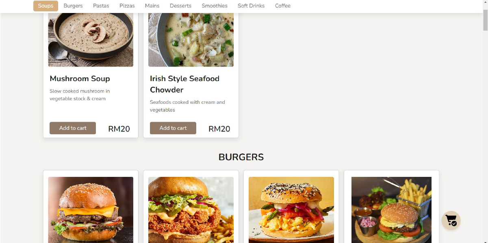
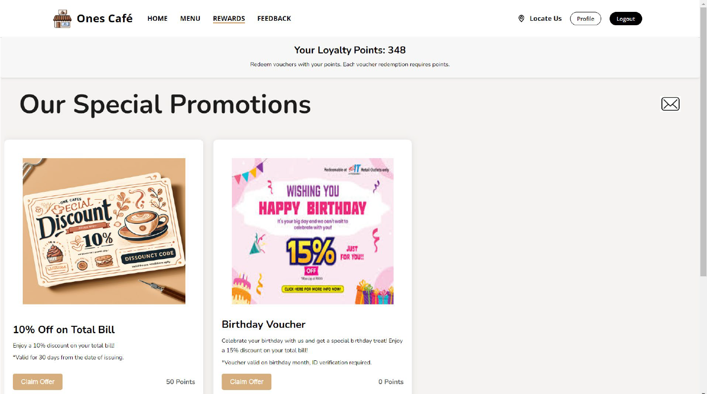
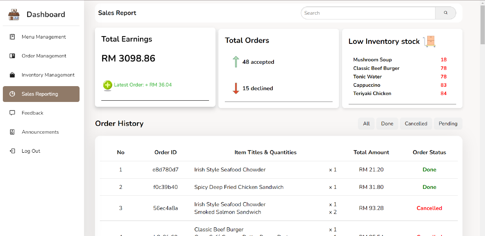
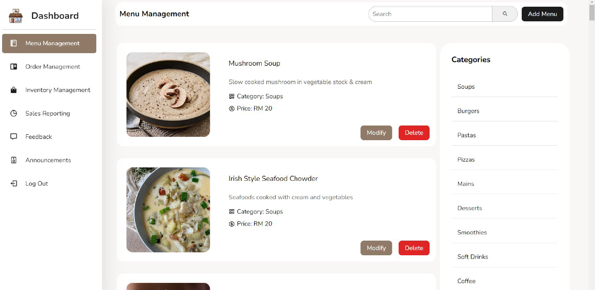

# Ones Café Web Application

**Ones Café** is a full-stack web application designed to digitize the cafe experience. It serves two main user groups: **Customers**, who can browse menus, place orders, and earn rewards; and **Administrators** (Cafe Owners), who can manage inventory, menus, orders, and view sales reports.

This project was developed for the **WIF2003 Web Programming** course (Semester 2, Session 2023/2024).

---

## 📖 Table of Contents
- [Features](#-features)
- [Tech Stack](#%EF%B8%8F-tech-stack)
- [Project Structure](#-project-structure)
- [Installation & Setup](#-installation--setup)
- [Environment Variables](#-environment-variables)
- [Screenshots](#-screenshots)

---

## 🚀 Features

### For Customers
* **User Authentication**: Secure Login, Registration, and Password Reset (via Email).
* **Profile Management**: Update personal details and view collected vouchers.
* **Menu Browsing**: View various food categories (Main Course, Pasta, Pizza, Burger, Sides, Beverages, Desserts).
* **Ordering System**: Add items to a cart and proceed to checkout.
* **Rewards Program**: Earn loyalty points and redeem vouchers (e.g., Birthday, 10% Off).
* **Feedback**: Submit ratings and reviews for the cafe.
* **Announcements**: View the latest news and promotions from the cafe.

### For Admins (Cafe Owners)
* **Dashboard**: Overview of cafe performance.
* **Menu Management**: Add, edit, or delete menu items (with image support).
* **Inventory Management**: Track stock levels for ingredients (e.g., Coffee beans, Milk, Burger buns).
* **Order Management**: View and process incoming customer orders.
* **Sales Reporting**: Visualize monthly sales data.
* **Feedback Monitoring**: View customer feedback and ratings.
* **Announcement System**: Create and publish announcements to the homepage.

---

## 🛠️ Tech Stack

**Frontend**
* **HTML5, CSS3, JavaScript**: Core web technologies.
* **EJS (Embedded JavaScript)**: Server-side templating engine for rendering dynamic views.

**Backend**
* **Node.js**: JavaScript runtime environment.
* **Express.js**: Web framework for handling routing and middleware.

**Database**
* **MongoDB**: NoSQL database for storing users, orders, menus, and inventory.
* **Mongoose**: ODM (Object Data Modeling) library for MongoDB.

**Other Tools**
* **Nodemailer**: For sending emails (password reset, etc.).
* **Multer**: For handling file uploads (menu images).
* **Chart.js**: For rendering sales graphs on the admin dashboard.

---

## 📂 Project Structure

```text
Ones-Cafe/
├── controllers/      # Logic for handling requests (Auth, Menu, Order, etc.)
├── models/           # Mongoose schemas (User, Order, Inventory, etc.)
├── routes/           # Express route definitions
├── services/         # Helper services (e.g., Email Sender, Data Seeder)
├── static/           # Public static files (CSS, Client-side JS, Images)
├── views/            # EJS Templates for the UI
│   ├── admin/        # Admin-specific pages
│   ├── layouts/      # Master layout templates
│   ├── partials/     # Reusable headers/footers
│   └── profile/      # User profile pages
├── .env              # Environment variables (not committed)
├── server.js         # Application entry point
└── package.json      # Project dependencies
```

---

## ⚙️ Installation & Setup

1.  **Prerequisites**
    * [Node.js](https://nodejs.org/) installed.
    * [MongoDB](https://www.mongodb.com/) installed and running locally, or a MongoDB Atlas connection string.

2.  **Clone the Repository**
    ```bash
    git clone [https://github.com/kahchun-haha/ones-cafe.git](https://github.com/kahchun-haha/ones-cafe.git)
    cd ones-cafe
    ```

3.  **Install Dependencies**
    ```bash
    npm install
    ```

4.  **Configure Environment**
    Create a `.env` file in the root directory and add the following variables (see [Environment Variables](#-environment-variables)).

5.  **Run the Server**
    ```bash
    # Run normally
    node server.js

    # Or with nodemon (if installed) for development
    nodemon server.js
    ```

6.  **Access the App**
    Open your browser and navigate to `http://localhost:3000`.

---

## 🔐 Environment Variables

Create a `.env` file in the root folder with the following keys:

```env
PORT=3000
MONGO_URL=mongodb://localhost:27017/onescafe  # Or your Atlas URI
SESSION_SECRET=your_secret_key_here
EMAIL=your_email_service_address@gmail.com    # For sending reset emails
PASSWORD=your_email_app_password
```

---

## 📸 Screenshots

### User Interface
| Login Page | Home Page |
| :---: | :---: |
|  |  |
| *Secure Login* | *Main Landing Page* |

| Menu Browsing | Rewards & Vouchers |
| :---: | :---: |
|  |  |
| *Food Categories & Search* | *Loyalty Points System* |

### Admin Interface
| Admin Dashboard | Menu Management |
| :---: | :---: |
|  |  |
| *Sales Analytics & Overview* | *Add, Edit & Delete Menu Items* |
